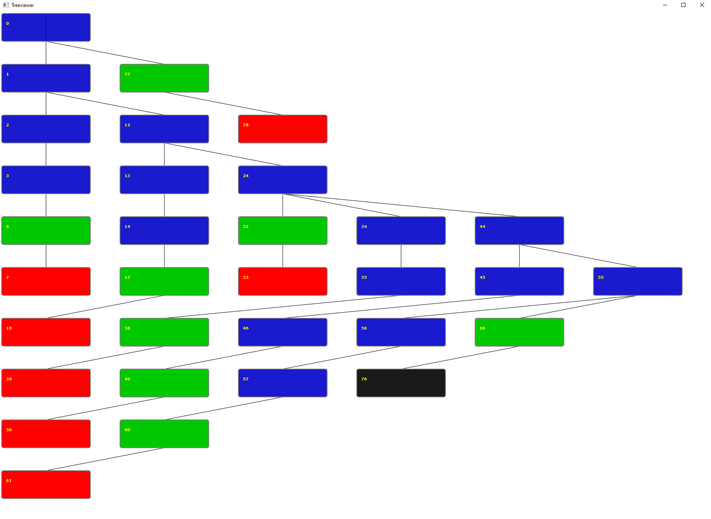

  

<h1>Parse Tree Viewer for JavaFX 12</h1>
This is a Tree viewer for JavaFX 12 for viewing Parse Trees generated by the SMILES Parser.

<h2>Purpose</h2>
This tool can be used to diagnose issues with a Parse Tree.  This is especially helpful with larger and more complex molecules.

<h2>Usage</h2>
Place a valid parse tree json file in your filesystem at the location specified in Line 287 of App.java. (Modify this URL to match your local machine) 

<h2>Data File Generation</h2>
Parse tree json files are generated by another Project Umami application currently under construction.  This application will be announced in the future.

<h2>Compilation</h2>
To run, enter this on the command line: mvn clean compile package javafx:run

<h2>Information</h2>
For more information about Project Umami, visit http://projectumami.com

<h2>Contact</h2>
For more information, contact inquiries@orchidwarestudios.com.
